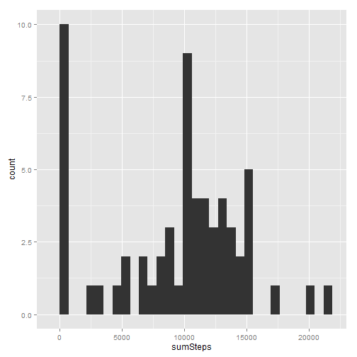
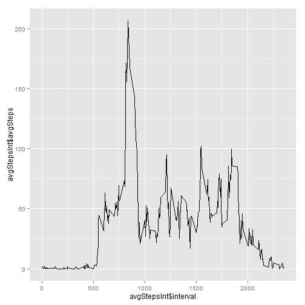
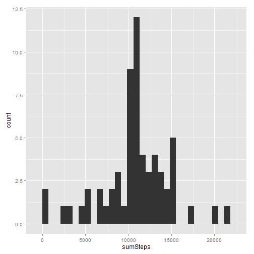
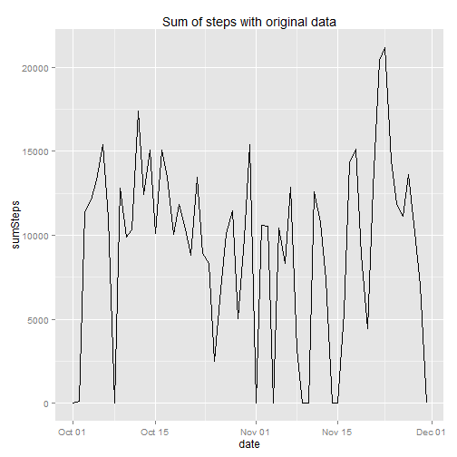
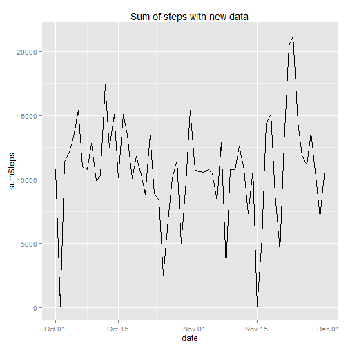
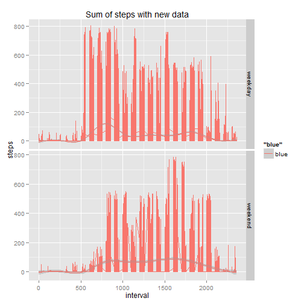

Assignment 1 - Reproducible Research
=====================================

This assignment makes use of data from a personal activity monitoring device. This device collects data at 5 minute intervals through out the day. The data consists of two months of data from an anonymous individual collected during the months of October and November, 2012 and include the number of steps taken in 5 minute intervals each day.


<b>Loading and preprocessing the data</b>  

```r
data <- read.csv("activity.csv",header=T,sep=",")
data <- transform(data,date=as.Date(date,"%Y-%m-%d"))
```

<b>What is mean total number of steps taken per day?</b>  

```r
library(plyr)
library(ggplot2)
library(xtable)
sumStepsData <- ddply(data,.(date),summarize,sumSteps=sum(steps,na.rm=T))
qplot(sumSteps, data=sumStepsData, geom="histogram")
```

```
## stat_bin: binwidth defaulted to range/30. Use 'binwidth = x' to adjust this.
```

 

```r
meanStepsData <- ddply(data,.(date),summarize,meanSteps=mean(steps,na.rm=T))
medianStepsData <- ddply(data,.(date),summarize,medianSteps=median(steps,na.rm=T))
m1 <- xtable(meanStepsData,type="html")
m2 <- xtable(medianStepsData,type="html")
print(m1,type="html")
```

```
## Warning: class of 'x' was discarded
```

<!-- html table generated in R 3.1.0 by xtable 1.7-3 package -->
<!-- Sun Jun 15 14:21:51 2014 -->
<TABLE border=1>
<TR> <TH>  </TH> <TH> date </TH> <TH> meanSteps </TH>  </TR>
  <TR> <TD align="right"> 1 </TD> <TD align="right"> 15614.00 </TD> <TD align="right">  </TD> </TR>
  <TR> <TD align="right"> 2 </TD> <TD align="right"> 15615.00 </TD> <TD align="right"> 0.44 </TD> </TR>
  <TR> <TD align="right"> 3 </TD> <TD align="right"> 15616.00 </TD> <TD align="right"> 39.42 </TD> </TR>
  <TR> <TD align="right"> 4 </TD> <TD align="right"> 15617.00 </TD> <TD align="right"> 42.07 </TD> </TR>
  <TR> <TD align="right"> 5 </TD> <TD align="right"> 15618.00 </TD> <TD align="right"> 46.16 </TD> </TR>
  <TR> <TD align="right"> 6 </TD> <TD align="right"> 15619.00 </TD> <TD align="right"> 53.54 </TD> </TR>
  <TR> <TD align="right"> 7 </TD> <TD align="right"> 15620.00 </TD> <TD align="right"> 38.25 </TD> </TR>
  <TR> <TD align="right"> 8 </TD> <TD align="right"> 15621.00 </TD> <TD align="right">  </TD> </TR>
  <TR> <TD align="right"> 9 </TD> <TD align="right"> 15622.00 </TD> <TD align="right"> 44.48 </TD> </TR>
  <TR> <TD align="right"> 10 </TD> <TD align="right"> 15623.00 </TD> <TD align="right"> 34.38 </TD> </TR>
  <TR> <TD align="right"> 11 </TD> <TD align="right"> 15624.00 </TD> <TD align="right"> 35.78 </TD> </TR>
  <TR> <TD align="right"> 12 </TD> <TD align="right"> 15625.00 </TD> <TD align="right"> 60.35 </TD> </TR>
  <TR> <TD align="right"> 13 </TD> <TD align="right"> 15626.00 </TD> <TD align="right"> 43.15 </TD> </TR>
  <TR> <TD align="right"> 14 </TD> <TD align="right"> 15627.00 </TD> <TD align="right"> 52.42 </TD> </TR>
  <TR> <TD align="right"> 15 </TD> <TD align="right"> 15628.00 </TD> <TD align="right"> 35.20 </TD> </TR>
  <TR> <TD align="right"> 16 </TD> <TD align="right"> 15629.00 </TD> <TD align="right"> 52.38 </TD> </TR>
  <TR> <TD align="right"> 17 </TD> <TD align="right"> 15630.00 </TD> <TD align="right"> 46.71 </TD> </TR>
  <TR> <TD align="right"> 18 </TD> <TD align="right"> 15631.00 </TD> <TD align="right"> 34.92 </TD> </TR>
  <TR> <TD align="right"> 19 </TD> <TD align="right"> 15632.00 </TD> <TD align="right"> 41.07 </TD> </TR>
  <TR> <TD align="right"> 20 </TD> <TD align="right"> 15633.00 </TD> <TD align="right"> 36.09 </TD> </TR>
  <TR> <TD align="right"> 21 </TD> <TD align="right"> 15634.00 </TD> <TD align="right"> 30.63 </TD> </TR>
  <TR> <TD align="right"> 22 </TD> <TD align="right"> 15635.00 </TD> <TD align="right"> 46.74 </TD> </TR>
  <TR> <TD align="right"> 23 </TD> <TD align="right"> 15636.00 </TD> <TD align="right"> 30.97 </TD> </TR>
  <TR> <TD align="right"> 24 </TD> <TD align="right"> 15637.00 </TD> <TD align="right"> 29.01 </TD> </TR>
  <TR> <TD align="right"> 25 </TD> <TD align="right"> 15638.00 </TD> <TD align="right"> 8.65 </TD> </TR>
  <TR> <TD align="right"> 26 </TD> <TD align="right"> 15639.00 </TD> <TD align="right"> 23.53 </TD> </TR>
  <TR> <TD align="right"> 27 </TD> <TD align="right"> 15640.00 </TD> <TD align="right"> 35.14 </TD> </TR>
  <TR> <TD align="right"> 28 </TD> <TD align="right"> 15641.00 </TD> <TD align="right"> 39.78 </TD> </TR>
  <TR> <TD align="right"> 29 </TD> <TD align="right"> 15642.00 </TD> <TD align="right"> 17.42 </TD> </TR>
  <TR> <TD align="right"> 30 </TD> <TD align="right"> 15643.00 </TD> <TD align="right"> 34.09 </TD> </TR>
  <TR> <TD align="right"> 31 </TD> <TD align="right"> 15644.00 </TD> <TD align="right"> 53.52 </TD> </TR>
  <TR> <TD align="right"> 32 </TD> <TD align="right"> 15645.00 </TD> <TD align="right">  </TD> </TR>
  <TR> <TD align="right"> 33 </TD> <TD align="right"> 15646.00 </TD> <TD align="right"> 36.81 </TD> </TR>
  <TR> <TD align="right"> 34 </TD> <TD align="right"> 15647.00 </TD> <TD align="right"> 36.70 </TD> </TR>
  <TR> <TD align="right"> 35 </TD> <TD align="right"> 15648.00 </TD> <TD align="right">  </TD> </TR>
  <TR> <TD align="right"> 36 </TD> <TD align="right"> 15649.00 </TD> <TD align="right"> 36.25 </TD> </TR>
  <TR> <TD align="right"> 37 </TD> <TD align="right"> 15650.00 </TD> <TD align="right"> 28.94 </TD> </TR>
  <TR> <TD align="right"> 38 </TD> <TD align="right"> 15651.00 </TD> <TD align="right"> 44.73 </TD> </TR>
  <TR> <TD align="right"> 39 </TD> <TD align="right"> 15652.00 </TD> <TD align="right"> 11.18 </TD> </TR>
  <TR> <TD align="right"> 40 </TD> <TD align="right"> 15653.00 </TD> <TD align="right">  </TD> </TR>
  <TR> <TD align="right"> 41 </TD> <TD align="right"> 15654.00 </TD> <TD align="right">  </TD> </TR>
  <TR> <TD align="right"> 42 </TD> <TD align="right"> 15655.00 </TD> <TD align="right"> 43.78 </TD> </TR>
  <TR> <TD align="right"> 43 </TD> <TD align="right"> 15656.00 </TD> <TD align="right"> 37.38 </TD> </TR>
  <TR> <TD align="right"> 44 </TD> <TD align="right"> 15657.00 </TD> <TD align="right"> 25.47 </TD> </TR>
  <TR> <TD align="right"> 45 </TD> <TD align="right"> 15658.00 </TD> <TD align="right">  </TD> </TR>
  <TR> <TD align="right"> 46 </TD> <TD align="right"> 15659.00 </TD> <TD align="right"> 0.14 </TD> </TR>
  <TR> <TD align="right"> 47 </TD> <TD align="right"> 15660.00 </TD> <TD align="right"> 18.89 </TD> </TR>
  <TR> <TD align="right"> 48 </TD> <TD align="right"> 15661.00 </TD> <TD align="right"> 49.79 </TD> </TR>
  <TR> <TD align="right"> 49 </TD> <TD align="right"> 15662.00 </TD> <TD align="right"> 52.47 </TD> </TR>
  <TR> <TD align="right"> 50 </TD> <TD align="right"> 15663.00 </TD> <TD align="right"> 30.70 </TD> </TR>
  <TR> <TD align="right"> 51 </TD> <TD align="right"> 15664.00 </TD> <TD align="right"> 15.53 </TD> </TR>
  <TR> <TD align="right"> 52 </TD> <TD align="right"> 15665.00 </TD> <TD align="right"> 44.40 </TD> </TR>
  <TR> <TD align="right"> 53 </TD> <TD align="right"> 15666.00 </TD> <TD align="right"> 70.93 </TD> </TR>
  <TR> <TD align="right"> 54 </TD> <TD align="right"> 15667.00 </TD> <TD align="right"> 73.59 </TD> </TR>
  <TR> <TD align="right"> 55 </TD> <TD align="right"> 15668.00 </TD> <TD align="right"> 50.27 </TD> </TR>
  <TR> <TD align="right"> 56 </TD> <TD align="right"> 15669.00 </TD> <TD align="right"> 41.09 </TD> </TR>
  <TR> <TD align="right"> 57 </TD> <TD align="right"> 15670.00 </TD> <TD align="right"> 38.76 </TD> </TR>
  <TR> <TD align="right"> 58 </TD> <TD align="right"> 15671.00 </TD> <TD align="right"> 47.38 </TD> </TR>
  <TR> <TD align="right"> 59 </TD> <TD align="right"> 15672.00 </TD> <TD align="right"> 35.36 </TD> </TR>
  <TR> <TD align="right"> 60 </TD> <TD align="right"> 15673.00 </TD> <TD align="right"> 24.47 </TD> </TR>
  <TR> <TD align="right"> 61 </TD> <TD align="right"> 15674.00 </TD> <TD align="right">  </TD> </TR>
   </TABLE>

```r
print(m2,type="html")
```

```
## Warning: class of 'x' was discarded
```

<!-- html table generated in R 3.1.0 by xtable 1.7-3 package -->
<!-- Sun Jun 15 14:21:51 2014 -->
<TABLE border=1>
<TR> <TH>  </TH> <TH> date </TH> <TH> medianSteps </TH>  </TR>
  <TR> <TD align="right"> 1 </TD> <TD align="right"> 15614.00 </TD> <TD align="right">  </TD> </TR>
  <TR> <TD align="right"> 2 </TD> <TD align="right"> 15615.00 </TD> <TD align="right"> 0.00 </TD> </TR>
  <TR> <TD align="right"> 3 </TD> <TD align="right"> 15616.00 </TD> <TD align="right"> 0.00 </TD> </TR>
  <TR> <TD align="right"> 4 </TD> <TD align="right"> 15617.00 </TD> <TD align="right"> 0.00 </TD> </TR>
  <TR> <TD align="right"> 5 </TD> <TD align="right"> 15618.00 </TD> <TD align="right"> 0.00 </TD> </TR>
  <TR> <TD align="right"> 6 </TD> <TD align="right"> 15619.00 </TD> <TD align="right"> 0.00 </TD> </TR>
  <TR> <TD align="right"> 7 </TD> <TD align="right"> 15620.00 </TD> <TD align="right"> 0.00 </TD> </TR>
  <TR> <TD align="right"> 8 </TD> <TD align="right"> 15621.00 </TD> <TD align="right">  </TD> </TR>
  <TR> <TD align="right"> 9 </TD> <TD align="right"> 15622.00 </TD> <TD align="right"> 0.00 </TD> </TR>
  <TR> <TD align="right"> 10 </TD> <TD align="right"> 15623.00 </TD> <TD align="right"> 0.00 </TD> </TR>
  <TR> <TD align="right"> 11 </TD> <TD align="right"> 15624.00 </TD> <TD align="right"> 0.00 </TD> </TR>
  <TR> <TD align="right"> 12 </TD> <TD align="right"> 15625.00 </TD> <TD align="right"> 0.00 </TD> </TR>
  <TR> <TD align="right"> 13 </TD> <TD align="right"> 15626.00 </TD> <TD align="right"> 0.00 </TD> </TR>
  <TR> <TD align="right"> 14 </TD> <TD align="right"> 15627.00 </TD> <TD align="right"> 0.00 </TD> </TR>
  <TR> <TD align="right"> 15 </TD> <TD align="right"> 15628.00 </TD> <TD align="right"> 0.00 </TD> </TR>
  <TR> <TD align="right"> 16 </TD> <TD align="right"> 15629.00 </TD> <TD align="right"> 0.00 </TD> </TR>
  <TR> <TD align="right"> 17 </TD> <TD align="right"> 15630.00 </TD> <TD align="right"> 0.00 </TD> </TR>
  <TR> <TD align="right"> 18 </TD> <TD align="right"> 15631.00 </TD> <TD align="right"> 0.00 </TD> </TR>
  <TR> <TD align="right"> 19 </TD> <TD align="right"> 15632.00 </TD> <TD align="right"> 0.00 </TD> </TR>
  <TR> <TD align="right"> 20 </TD> <TD align="right"> 15633.00 </TD> <TD align="right"> 0.00 </TD> </TR>
  <TR> <TD align="right"> 21 </TD> <TD align="right"> 15634.00 </TD> <TD align="right"> 0.00 </TD> </TR>
  <TR> <TD align="right"> 22 </TD> <TD align="right"> 15635.00 </TD> <TD align="right"> 0.00 </TD> </TR>
  <TR> <TD align="right"> 23 </TD> <TD align="right"> 15636.00 </TD> <TD align="right"> 0.00 </TD> </TR>
  <TR> <TD align="right"> 24 </TD> <TD align="right"> 15637.00 </TD> <TD align="right"> 0.00 </TD> </TR>
  <TR> <TD align="right"> 25 </TD> <TD align="right"> 15638.00 </TD> <TD align="right"> 0.00 </TD> </TR>
  <TR> <TD align="right"> 26 </TD> <TD align="right"> 15639.00 </TD> <TD align="right"> 0.00 </TD> </TR>
  <TR> <TD align="right"> 27 </TD> <TD align="right"> 15640.00 </TD> <TD align="right"> 0.00 </TD> </TR>
  <TR> <TD align="right"> 28 </TD> <TD align="right"> 15641.00 </TD> <TD align="right"> 0.00 </TD> </TR>
  <TR> <TD align="right"> 29 </TD> <TD align="right"> 15642.00 </TD> <TD align="right"> 0.00 </TD> </TR>
  <TR> <TD align="right"> 30 </TD> <TD align="right"> 15643.00 </TD> <TD align="right"> 0.00 </TD> </TR>
  <TR> <TD align="right"> 31 </TD> <TD align="right"> 15644.00 </TD> <TD align="right"> 0.00 </TD> </TR>
  <TR> <TD align="right"> 32 </TD> <TD align="right"> 15645.00 </TD> <TD align="right">  </TD> </TR>
  <TR> <TD align="right"> 33 </TD> <TD align="right"> 15646.00 </TD> <TD align="right"> 0.00 </TD> </TR>
  <TR> <TD align="right"> 34 </TD> <TD align="right"> 15647.00 </TD> <TD align="right"> 0.00 </TD> </TR>
  <TR> <TD align="right"> 35 </TD> <TD align="right"> 15648.00 </TD> <TD align="right">  </TD> </TR>
  <TR> <TD align="right"> 36 </TD> <TD align="right"> 15649.00 </TD> <TD align="right"> 0.00 </TD> </TR>
  <TR> <TD align="right"> 37 </TD> <TD align="right"> 15650.00 </TD> <TD align="right"> 0.00 </TD> </TR>
  <TR> <TD align="right"> 38 </TD> <TD align="right"> 15651.00 </TD> <TD align="right"> 0.00 </TD> </TR>
  <TR> <TD align="right"> 39 </TD> <TD align="right"> 15652.00 </TD> <TD align="right"> 0.00 </TD> </TR>
  <TR> <TD align="right"> 40 </TD> <TD align="right"> 15653.00 </TD> <TD align="right">  </TD> </TR>
  <TR> <TD align="right"> 41 </TD> <TD align="right"> 15654.00 </TD> <TD align="right">  </TD> </TR>
  <TR> <TD align="right"> 42 </TD> <TD align="right"> 15655.00 </TD> <TD align="right"> 0.00 </TD> </TR>
  <TR> <TD align="right"> 43 </TD> <TD align="right"> 15656.00 </TD> <TD align="right"> 0.00 </TD> </TR>
  <TR> <TD align="right"> 44 </TD> <TD align="right"> 15657.00 </TD> <TD align="right"> 0.00 </TD> </TR>
  <TR> <TD align="right"> 45 </TD> <TD align="right"> 15658.00 </TD> <TD align="right">  </TD> </TR>
  <TR> <TD align="right"> 46 </TD> <TD align="right"> 15659.00 </TD> <TD align="right"> 0.00 </TD> </TR>
  <TR> <TD align="right"> 47 </TD> <TD align="right"> 15660.00 </TD> <TD align="right"> 0.00 </TD> </TR>
  <TR> <TD align="right"> 48 </TD> <TD align="right"> 15661.00 </TD> <TD align="right"> 0.00 </TD> </TR>
  <TR> <TD align="right"> 49 </TD> <TD align="right"> 15662.00 </TD> <TD align="right"> 0.00 </TD> </TR>
  <TR> <TD align="right"> 50 </TD> <TD align="right"> 15663.00 </TD> <TD align="right"> 0.00 </TD> </TR>
  <TR> <TD align="right"> 51 </TD> <TD align="right"> 15664.00 </TD> <TD align="right"> 0.00 </TD> </TR>
  <TR> <TD align="right"> 52 </TD> <TD align="right"> 15665.00 </TD> <TD align="right"> 0.00 </TD> </TR>
  <TR> <TD align="right"> 53 </TD> <TD align="right"> 15666.00 </TD> <TD align="right"> 0.00 </TD> </TR>
  <TR> <TD align="right"> 54 </TD> <TD align="right"> 15667.00 </TD> <TD align="right"> 0.00 </TD> </TR>
  <TR> <TD align="right"> 55 </TD> <TD align="right"> 15668.00 </TD> <TD align="right"> 0.00 </TD> </TR>
  <TR> <TD align="right"> 56 </TD> <TD align="right"> 15669.00 </TD> <TD align="right"> 0.00 </TD> </TR>
  <TR> <TD align="right"> 57 </TD> <TD align="right"> 15670.00 </TD> <TD align="right"> 0.00 </TD> </TR>
  <TR> <TD align="right"> 58 </TD> <TD align="right"> 15671.00 </TD> <TD align="right"> 0.00 </TD> </TR>
  <TR> <TD align="right"> 59 </TD> <TD align="right"> 15672.00 </TD> <TD align="right"> 0.00 </TD> </TR>
  <TR> <TD align="right"> 60 </TD> <TD align="right"> 15673.00 </TD> <TD align="right"> 0.00 </TD> </TR>
  <TR> <TD align="right"> 61 </TD> <TD align="right"> 15674.00 </TD> <TD align="right">  </TD> </TR>
   </TABLE>

<b> What is the average daily activity pattern? </b>  
1.Make a time series plot (i.e. type = "l") of the 5-minute interval (x-axis) and the average number of steps taken, averaged across all days (y-axis)

```r
avgStepsInt <- ddply(data,.(interval),summarize,avgSteps=mean(steps,na.rm=T))
p <- ggplot(avgStepsInt,aes(x=avgStepsInt$interval,y=avgStepsInt$avgSteps))
p+geom_line()
```

 

2.Which 5-minute interval, on average across all the days in the dataset, contains the maximum number of steps

```r
avgStepsInt[avgStepsInt$avgSteps==max(avgStepsInt$avgSteps),]
```

```
##     interval avgSteps
## 104      835    206.2
```

<b>Imputing missing values</b>  

1.Calculate and report the total number of missing values in the dataset (i.e. the total number of rows with NAs)

```r
sum(is.na(data$steps))
```

```
## [1] 2304
```


2.Devise a strategy for filling in all of the missing values in the dataset. The strategy does not need to be sophisticated. For example, you could use the mean/median for that day, or the mean for that 5-minute interval, etc.  
This strategy includes replacing NA with the average 5 min available data from other days  

```r
avgStepsInt <- ddply(data,.(interval),summarize,avgSteps=mean(steps,na.rm=T))
for (i in 1:dim(data)[[1]])
 {
   if(is.na(data$steps[i]))
   {
     data$steps[i] = avgStepsInt$avgSteps[avgStepsInt$interval==data$interval[i]]
   }
 }
```


3.Create a new dataset that is equal to the original dataset but with the missing data filled in.


```r
newData <- data
```

4.Make a histogram of the total number of steps taken each day and Calculate and report the mean and median total number of steps taken per day. Do these values differ from the estimates from the first part of the assignment? What is the impact of imputing missing data on the estimates of the total daily number of steps?

```r
sumStepsNewData <- ddply(newData,.(date),summarize,sumSteps=sum(steps,na.rm=T))
qplot(sumSteps, data=sumStepsNewData, geom="histogram")
```

```
## stat_bin: binwidth defaulted to range/30. Use 'binwidth = x' to adjust this.
```

 

```r
meanStepsNewData <- ddply(newData,.(date),summarize,meanSteps=mean(steps,na.rm=T))
medianStepsNewData <- ddply(newData,.(date),summarize,medianSteps=median(steps,na.rm=T))
identical(sumStepsData,sumStepsNewData)
```

```
## [1] FALSE
```

```r
identical(meanStepsData,meanStepsNewData)
```

```
## [1] FALSE
```

```r
identical(medianStepsData,medianStepsNewData)
```

```
## [1] FALSE
```

Plot sum of steps with the original and modified data for exploratory analysis

```r
p1 <- 
    ggplot(sumStepsData, aes(x=date, y=sumSteps)) +
    geom_line() +
    ggtitle("Sum of steps with original data")

# Second plot
p2 <- 
   ggplot(sumStepsNewData, aes(x=date, y=sumSteps)) +
    geom_line() +
    ggtitle("Sum of steps with new data")
p1
```

 

```r
p2
```

 

<b>Are there differences in activity patterns between weekdays and weekends?</b>  


```r
newData$weekday <- ifelse(weekdays(newData$date)=="Saturday" | weekdays(newData$date)=="Sunday","weekend","weekday")
newData$weekday <- factor(newData$weekday,levels=c("weekday","weekend"),labels=c("weekday","weekend"))
p <- 
   ggplot(newData, aes(x=interval, y=steps, color="blue")) +
    geom_line() + stat_smooth() +
    ggtitle("Sum of steps with new data")
p + facet_grid(weekday ~ ., scales = "free_y")
```

```
## geom_smooth: method="auto" and size of largest group is >=1000, so using gam with formula: y ~ s(x, bs = "cs"). Use 'method = x' to change the smoothing method.
## geom_smooth: method="auto" and size of largest group is >=1000, so using gam with formula: y ~ s(x, bs = "cs"). Use 'method = x' to change the smoothing method.
```

 
